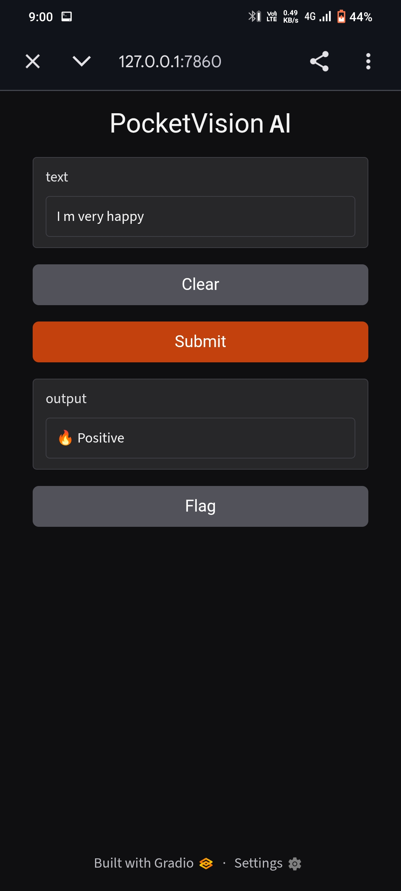
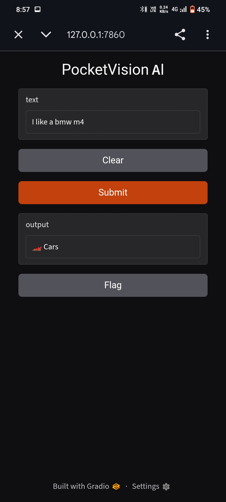

# Provision AI

A simple Machine Learning text classifier built entirely on Android.

Features:
- Text classification
- Browser interface
- Local ML model

Tech Stack:
- Python
- Gradio
- Scikit Learn
- Joblib

Files:
- app.py → Runs the app
- train.py → Trains model
- model.pkl → Saved trained model

Built using Pydroid 3.
## Preview

